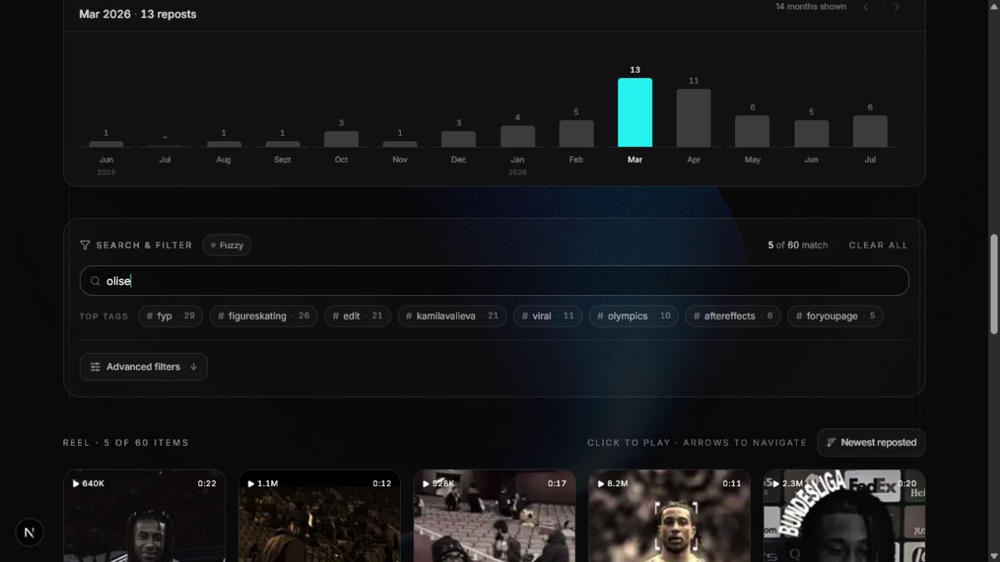
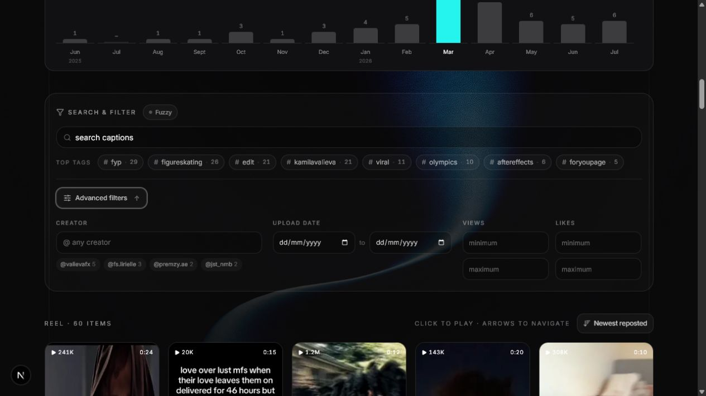
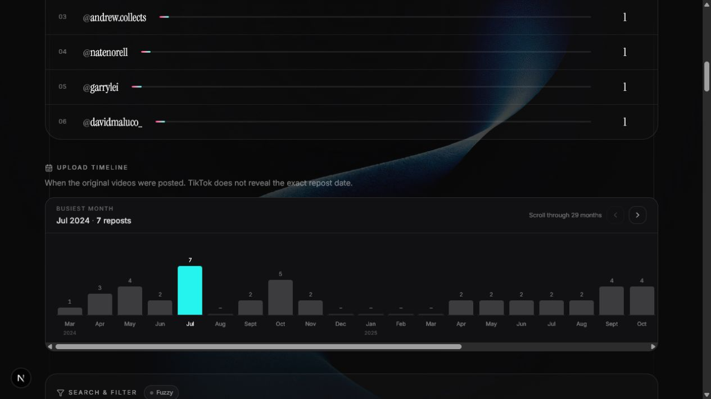
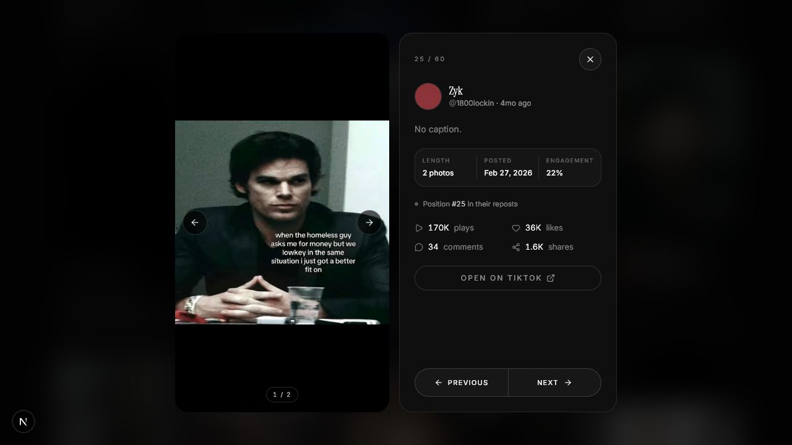

<h1 align="center">Repostify</h1>

  <strong>Their reposts tell on them.</strong> 
  Search a crush, an ex, or any creator. Turn visible TikTok reposts into a searchable, playable trail.

  <a href="https://github.com/xtofuub/Repostify/releases/latest"><strong>Download for Windows</strong></a>
  &nbsp;&nbsp;|&nbsp;&nbsp;
  <a href="#build-from-source">Build from source</a>

  
  
  

  

## Start here

1. Download the **Setup EXE** from the [latest release](https://github.com/xtofuub/Repostify/releases/latest).
2. Open Repostify and paste a TikTok handle.
3. Scan the visible repost feed.
4. Search captions and hashtags by keyword, sort the feed, or open any post.

No account is needed for public profiles. You can optionally connect TikTok for profiles your account is allowed to view.

## What can Repostify do?

- **Search the repost trail**: filter captions and hashtags by any keyword or phrase.
- **Use advanced filters**: narrow the feed by date, creator, views, likes, and keywords together.
- **Compare two accounts**: find the exact videos that appear in both repost feeds.
- **Spot patterns**: see repeated creators, hashtags, engagement totals, and timeline activity.
- **Sort the feed**: newest reposted, oldest reposted, upload date, views, likes, comments, shares, or duration.
- **Play everything in one place**: open videos and photo posts without digging through TikTok tabs.
- **Show useful details**: caption, creator, original publish date, duration, views, likes, comments, and shares.
- **Load repeat scans quickly**: successful results stay in a short local cache that you can clear anytime.

## Download choices

The [latest release](https://github.com/xtofuub/Repostify/releases/latest) includes two Windows builds:

- **Setup EXE (recommended)**: installs Repostify, appears in Windows Installed Apps, includes an uninstaller, and updates in place.
- **Portable EXE**: runs without installation. Keep it anywhere and delete it when you are done.

Windows 10 or 11 x64 is required. Repostify is not code-signed yet, so Windows may show a SmartScreen warning. The Portable build can take longer on its first launch because it unpacks itself before starting.

## See it in action

### Scan and search a repost feed

This scan of `@beabadoue` shows the profile summary, visible repost totals, and engagement at a glance.

  

### Search reposts by keyword

Filter captions and hashtags without rescanning. Here, `olise` narrows 60 visible reposts to five matching football edits.

  

### Narrow the trail with advanced filters

Combine dates, creators, views, likes, and keywords to find the exact reposts you care about.

  

### Find the creators they amplify most

  

### See when their reposted videos were published

The timeline shows every month and count directly, calls out the busiest period, and adds scroll controls when more dates are available.

  

### Play a repost and inspect the details

Repostify tries TikTok's player first and shows the caption, exact publish date, feed position, engagement, and Previous or Next controls beside it.

  

Photo posts include on-image Previous and Next controls, plus a clear photo count.

  

## What it can and cannot see

Repostify reads the repost feed that TikTok Web gives the active browser session. It does not use a third-party repost API.

- Public profiles usually work without login.
- A connected TikTok session can help with profiles that account may view.
- Some private or audience-controlled profiles remain mobile-only and return TikTok access code `10222`.
- Hidden repost tabs, captchas, and temporary TikTok rate limits cannot be bypassed.
- TikTok normally provides the video's original publish date, not the exact moment someone reposted it.

## Privacy

- No Repostify account or SQLite database.
- Connected TikTok data stays on your device.
- Successful scans use a 24-hour local JSON cache.
- Clear the scan cache anytime from **Settings > Scan cache**.
- Repostify is read-only. It cannot follow, like, repost, comment, or message anyone.

## Build from source

You need Git, Node.js 20.9 or newer, and pnpm.

~~~bash
git clone https://github.com/xtofuub/Repostify.git
cd Repostify
corepack enable
pnpm install --frozen-lockfile
pnpm dev
~~~

Open [http://localhost:3000](http://localhost:3000).

The first scan downloads [cloakbrowser](https://github.com/CloakHQ/CloakBrowser) to `~/.cloakbrowser/`. That browser is reused for later scans.

<strong>Build the Windows EXEs</strong>

~~~bash
# Installer
pnpm desktop:build

# Portable
node desktop/build.cjs --portable
~~~

The finished files are written to:

~~~text
release/Repostify-<version>-Windows-x64-Setup.exe
release/Repostify-<version>-Windows-x64-Portable.exe
~~~

<strong>Run a production web build</strong>

~~~bash
pnpm build
pnpm start
~~~

The scraper needs a persistent Node.js host that can launch Chromium. A standard serverless Vercel deployment is not suitable.

<strong>How scanning works</strong>

1. Repostify launches [cloakbrowser](https://github.com/CloakHQ/CloakBrowser), a patched Chromium build.
2. It opens `tiktok.com/@handle` with an anonymous or connected TikTok session.
3. It opens the Reposts tab and captures TikTok's repost-list response.
4. It follows TikTok's cursor until the selected scan limit is reached.
5. It normalizes and deduplicates the results before showing them locally.

<strong>Local API</strong>

~~~http
GET /api/reposts?username=<handle>&limit=<n>&refresh=<0|1>
~~~

| Parameter | Description |
| --- | --- |
| `username` | TikTok handle without `@`. Required. |
| `limit` | Repost cap. Use `0` or omit it for no cap. Maximum 5000. |
| `refresh` | Use `1` to bypass the 24-hour local cache. |

## Uninstall

- **Setup build**: open **Windows Settings > Apps > Installed apps > Repostify > Uninstall**.
- **Portable build**: close Repostify and delete the Portable EXE.

## Tech stack

Next.js 16, React 19, TypeScript, Tailwind CSS v4, Electron, Motion, Playwright, and [cloakbrowser](https://github.com/CloakHQ/CloakBrowser).

## License

MIT. Repostify is not affiliated with or endorsed by TikTok or ByteDance.
