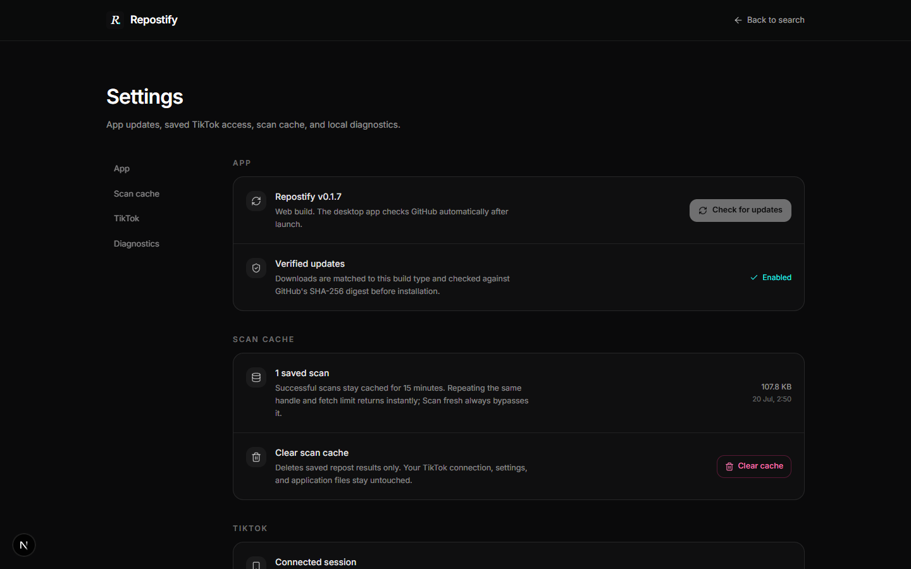
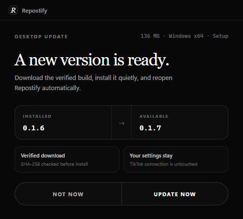

<h1 align="center">Repostify</h1>

  <strong>Browse visible TikTok reposts in one clean Windows app.</strong> 
  Scan a profile, filter the feed, compare creators, and play videos without leaving the app.

  
  
  

  

## Download

Open the [latest release](https://github.com/xtofuub/Repostify/releases/latest) and choose:

- **Setup EXE**: installs Repostify, adds an uninstaller, and supports automatic in-place updates.
- **Portable EXE**: runs without installation and updates the same portable file in place.

Windows 10 or 11 x64 is required. Repostify is not code-signed yet, so Windows may show a SmartScreen warning for a new release.
The Portable build unpacks itself on launch, so its first start is slower than the installed build.

## What Repostify gives you

- **Complete scan view**: profile details, aggregate engagement, top amplified creators, tags, timeline, and a filterable repost grid.
- **TikTok-native playback**: the TikTok player is used first. A built-in direct player is available when the embed fails.
- **Video details**: creator, caption, exact original publish date, duration, engagement rate, counts, and position in the repost feed.
- **Fast navigation**: use Previous / Next, arrow keys, <code>j</code> / <code>k</code>, or the mouse wheel.
- **Photo posts with music**: slideshows advance in-app and play the attached TikTok track when TikTok provides it.
- **Connected TikTok access**: optionally connect an account for profiles that TikTok Web allows that account to view.
- **Short local cache**: successful scans are saved as plain JSON for 15 minutes. Repeat scans load instantly, and **Scan fresh** bypasses the cache.
- **Desktop settings**: check the version, update the app, manage TikTok access, clear cache, and open diagnostics.
- **Verified updates**: Setup and Portable downloads are matched to the build type and verified against GitHub's SHA-256 digest before they run.

## Screenshots

### Profile results

Profile summary, total engagement, timeline, creators, hashtags, and the repost reel live on one page.

  

### Top amplified creators

Repostify counts how often each original creator appears and ranks the most amplified accounts.

  

### Player and video details

The default is TikTok's player. If TikTok reports that a video is unavailable, switch to the direct fallback without leaving the panel.

  

### Settings

  

### In-app updates

  

## How scanning works

1. Repostify launches [cloakbrowser](https://github.com/CloakHQ/CloakBrowser), a patched Chromium build.
2. It opens <code>tiktok.com/@handle</code> using either an anonymous session or the optional connected TikTok session.
3. It opens the Reposts tab and captures TikTok's own repost-list request.
4. It follows the captured cursor until the chosen limit is reached.
5. Results are normalized, deduplicated, and returned to the local app.

No third-party repost API is involved. Repostify can only show cards that TikTok Web returns to the active browser session.

## Privacy and local data

- Repostify has no user-account system and no SQLite database.
- A connected TikTok session stays on the device in Repostify's app-data folder.
- Successful scans use a 15-minute JSON cache. Clear it anytime from **Settings > Scan cache**.
- Logs and diagnostics stay local unless you choose to share them.
- Repostify is read-only. It does not follow, like, repost, comment, or message anyone.

## Limits

- **Private and audience-controlled profiles**: connecting TikTok helps only when TikTok Web exposes the profile to that signed-in account. TikTok may still return access code <code>10222</code> even when the mobile app can view it.
- **Hidden repost tabs**: Repostify cannot read a tab TikTok does not render.
- **Rate limits and captchas**: TikTok can temporarily return an empty list or block a scan. Waiting before retrying usually helps.
- **Repost date**: TikTok normally exposes the original video's publish date, not the exact time another account reposted it. Feed order remains the reliable repost-recency signal.
- **Large feeds**: hundreds of reposts can take several minutes because TikTok is the bottleneck.

## Run from source

Requirements: Git, Node.js 20.9 or newer, and pnpm.

~~~bash
git clone https://github.com/xtofuub/Repostify.git
cd Repostify
corepack enable
pnpm install --frozen-lockfile
pnpm dev
~~~

Open [http://localhost:3000](http://localhost:3000).

The first scan downloads cloakbrowser to <code>~/.cloakbrowser/</code>. The browser download is several hundred MB and is reused afterward.

### Production web build

~~~bash
pnpm build
pnpm start
~~~

Repostify needs a persistent Node.js host that can launch Chromium. A standard serverless Vercel deployment is not suitable for the scraper.

## Build the Windows EXEs

Install dependencies first, then run:

~~~bash
# Windows installer
pnpm desktop:build

# No-install portable build
node desktop/build.cjs --portable
~~~

Artifacts are written to:

~~~text
release/Repostify-<version>-Windows-x64-Setup.exe
release/Repostify-<version>-Windows-x64-Portable.exe
~~~

The desktop build packages the Next.js runtime, Electron shell, cloakbrowser integration, icons, settings, updater, and uninstall metadata.

## Uninstall

- **Setup build**: open **Windows Settings > Apps > Installed apps > Repostify > Uninstall**.
- **Portable build**: close Repostify and delete the Portable EXE.

Local settings and TikTok session data are kept separately in the Windows app-data folder. Open **Settings > Diagnostics** before uninstalling if you also want to locate and remove that folder.

## API

~~~http
GET /api/reposts?username=<handle>&limit=<n>&refresh=<0|1>
~~~

| Parameter | Description |
| --- | --- |
| <code>username</code> | TikTok handle without <code>@</code>. Required. |
| <code>limit</code> | Repost cap. Omit or use <code>0</code> for no cap. Maximum 5000. |
| <code>refresh</code> | Use <code>1</code> to bypass the 15-minute local cache. |

## Project map

~~~text
src/app/                    Next.js pages and route handlers
src/app/api/reposts/        Repost scraper endpoint
src/app/api/img/            TikTok image proxy
src/app/api/video/          Direct media fallback
src/components/             Search, cards, player, settings, UI
src/lib/tiktok.ts           Scraper, pagination, session handling
src/lib/repost-cache.ts     Short-lived local JSON cache
desktop/                    Electron shell, updater, packaging
scripts/                    Login, smoke checks, screenshots
~~~

## Tech stack

Next.js 16, React 19, TypeScript, Tailwind CSS v4, Electron, motion, Playwright, and [cloakbrowser](https://github.com/CloakHQ/CloakBrowser).

## License

MIT. Repostify is not affiliated with or endorsed by TikTok or ByteDance.
