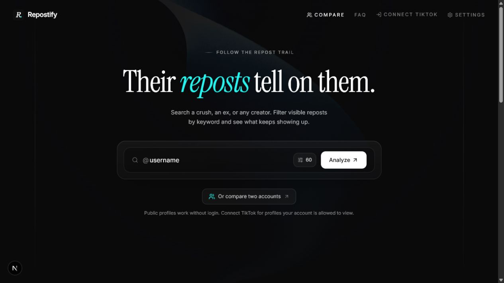
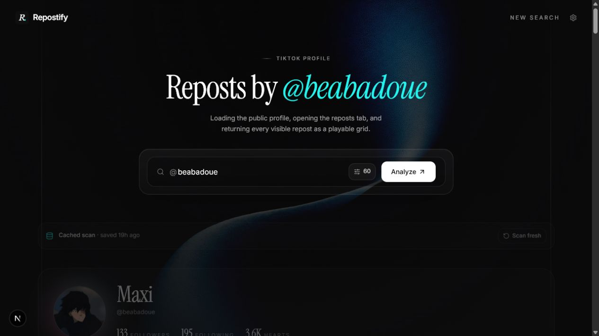
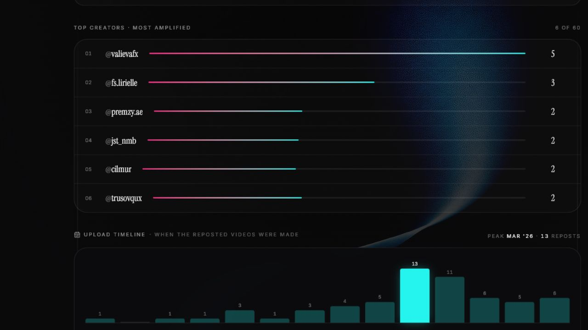
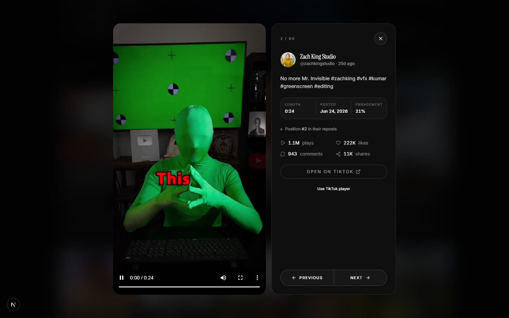
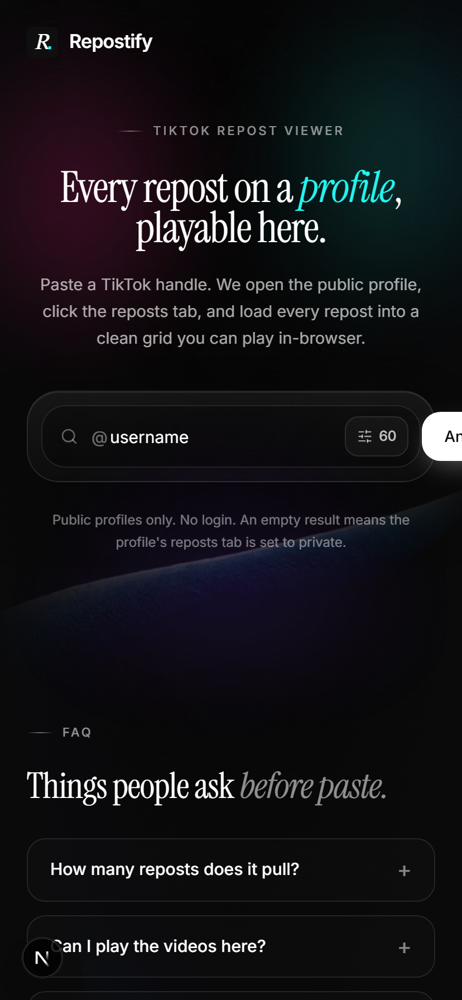

<h1 align="center">Repostify</h1>

<p align="center">
  <strong>See every TikTok repost on any public profile.</strong><br/>
  No login. No API key. No notification to the account you're checking.
</p>

<p align="center">
  
</p>

---

## What it does

Paste any public TikTok handle → Repostify opens the profile as an anonymous visitor, walks the reposts tab, and lays every repost out as a playable grid with stats, top-amplified creators, and one-click in-browser video playback.

The reposts tab is where someone's taste actually lives. Likes are noise. Posts are performance. Reposts are what they wanted their followers to see. This tool flattens that feed into a single page you can scan in seconds.

## Screenshots

### Result page

Per-profile view: header, full stats row, top-creators leaderboard, repost grid.

<p align="center">
  
</p>

### Top creators ranking

Counts how many times each original creator appears in the feed, ranked.

<p align="center">
  
</p>

### Inline player

Click any cover → full-screen overlay with TikTok's embed player + caption, stats, position counter, and prev/next nav.

<p align="center">
  
</p>

### Mobile

<p align="center">
  
</p>

---

## Features

- **Profile overview** — Avatar, bio, follower / following / hearts pulled from the public page rehydration script.
- **Repost grid** — 9:16 cover thumbnails with duration badge, original creator handle, play overlay, and per-video engagement stats.
- **Inline player** — TikTok embed iframe + detail panel. Scroll wheel, arrow keys, j/k, or the buttons to navigate.
- **Aggregate stats** — Total plays, likes, comments, shares, and unique creators across the captured batch.
- **Top creators leaderboard** — Frequency-ranked list of every original creator with horizontal bar chart.
- **Caption filter** — Type a word (`fyp`, `lol`, `edit`) to filter the grid live. Toggle between fuzzy substring and exact-word match. Top extracted hashtags suggested.
- **Fetch-limit selector** — Hidden in a popover behind the search bar gear: 30 / 60 / 120 / 250 / All.
- **Bot-detection bypass** — Uses [cloakbrowser](https://github.com/CloakHQ/CloakBrowser) (stealth Chromium with source-level C++ fingerprint patches) instead of stock Playwright, so TikTok serves the full repost feed instead of cutting off at the captcha gate.
- **Direct-cursor pagination** — After the first XHR fires, subsequent pages are fetched via the captured URL template, not by scrolling. Roughly 35% faster on big feeds.
- **Image proxy** — TikTok blocks hotlinks; all thumbnails route through `/api/img` with the Referer header set.
- **SEO** — Dynamic per-handle metadata, JSON-LD (`WebApplication`, `FAQPage`, `BreadcrumbList`, `Article`), sitemap with curated popular handles, `robots.txt`.

## How the scraper works

1. Cloakbrowser launches a stealth Chromium (binary-level fingerprint patches, undetectable as automation).
2. Navigates to `https://www.tiktok.com/@<handle>`.
3. Dismisses the cookie banner via shadow-DOM traversal.
4. Parses `__UNIVERSAL_DATA_FOR_REHYDRATION__` for profile + initial repost list.
5. Finds the Reposts tab by `role="tab"` text match, clicks it.
6. Captures the first `/api/repost/item_list/` XHR as a URL template.
7. Paginates: each subsequent call hits the same URL with an updated cursor via `page.evaluate(fetch)` (TikTok's own fetch interceptor signs the request).
8. Detects captcha / private-tab / server-block signals, bails fast.
9. Normalizes, dedupes, sorts by recency.

No login. No undocumented API. The data is everything TikTok would show any anonymous visitor.

## Tech stack

| Layer            | Choice                                                                                       |
| ---------------- | -------------------------------------------------------------------------------------------- |
| Framework        | [Next.js](https://nextjs.org) 16.2.10 (App Router, Turbopack, React Compiler)                |
| Runtime          | React 19                                                                                     |
| Styling          | Tailwind CSS v4 with `@theme inline`                                                         |
| Components       | shadcn/ui                                                                                    |
| Animation        | motion (Framer Motion v12)                                                                   |
| Scraping         | [cloakbrowser](https://github.com/CloakHQ/CloakBrowser) (stealth Chromium, Playwright API)   |
| Icons            | lucide-react                                                                                 |
| Fonts            | Inter + Instrument Serif (via `next/font`)                                                   |
| Language         | TypeScript 5                                                                                 |
| Package manager  | pnpm                                                                                         |

## Getting started

```bash
pnpm install
pnpm dev
```

First use downloads the cloakbrowser binary (several hundred MB, cached in `~/.cloakbrowser/`).

Open [http://localhost:3000](http://localhost:3000). Paste a handle, pick a fetch limit, hit Analyze.

### Production build

```bash
pnpm build
pnpm start
```

### Windows desktop app

Requirements: Windows 10/11 x64, Git, Node.js 20.9 or newer, and pnpm.

Clone and install dependencies:

```bash
git clone https://github.com/xtofuub/Repostify.git
cd Repostify
corepack enable
pnpm install --frozen-lockfile
```

Build the Windows installer from source:

```bash
pnpm desktop:build
```

Build the no-install portable EXE from source:

```bash
node desktop/build.cjs --portable
```

The files are written to:

- `release/Repostify-<version>-Windows-x64-Setup.exe`
- `release/Repostify-<version>-Windows-x64-Portable.exe`

It runs the Next.js server locally, opens it in a hardened Electron window, and
stores session data and logs under the current Windows user's app-data folder.

### Debug mode

```bash
DEBUG_TIKTOK=1 pnpm dev
```

Dumps the raw first XHR response, full page HTML, and a viewport screenshot into `.debug/` for each scrape.

## API

```
GET /api/reposts?username=<handle>&limit=<n>
```

| Param      | Notes                                                |
| ---------- | ---------------------------------------------------- |
| `username` | Required. TikTok handle without `@`.                 |
| `limit`    | Optional integer. Omit or `0` = no cap. Max 2000.    |

Returns:

```ts
{
  username: string;
  profile: { nickname, avatar, verified, bio, followers, following, likes } | null;
  reposts: Repost[];
  hasMore: boolean;
  captchaSuspected: boolean;
  fetchedAt: number;
}
```

## Project layout

```
src/
├── app/
│   ├── page.tsx              # Home: hero + search + FAQ + CTA
│   ├── u/[username]/         # Per-handle result page (auto-scrapes on load)
│   ├── about/, guide/, privacy/
│   ├── api/
│   │   ├── reposts/          # GET /api/reposts (the scraper endpoint)
│   │   ├── img/              # Image proxy (24 h cache, domain-whitelisted)
│   │   └── video/            # Video proxy fallback (mostly unused)
│   ├── sitemap.ts            # Static routes + popular handles
│   └── robots.ts             # Disallows /api/
├── components/
│   ├── repost-search.tsx     # Main client component: state machine + UI
│   ├── repost-card.tsx       # Thumbnail card
│   ├── repost-player.tsx     # Full-screen overlay player
│   ├── brand.tsx             # LogoMark, PrimaryButton, GuideLines, BackgroundVideo
│   └── ui/                   # shadcn primitives
├── lib/
│   ├── tiktok.ts             # Scraper core (~700 lines)
│   ├── seo.ts                # Site constants + popular-handle list
│   ├── format.ts             # Number / time formatters
│   └── utils.ts              # cn()
└── instrumentation.ts        # Next.js boot hook: pre-warms cloakbrowser
```

## Limitations

- **Private reposts tabs** — Many accounts hide it. That's a TikTok setting; can't bypass without auth.
- **Repost timestamps** — TikTok's anonymous endpoint exposes only the original video's createTime, not when the user reposted it. Order in the feed (most-recent-first) is the only repost-recency signal.
- **Big feeds are slow** — 500+ items can take 2-3 min. TikTok server is the bottleneck. Pick a smaller fetch limit if you only need the recent.
- **Read-only** — No write ops, no logged-in sessions, no DM-anyone weirdness.
- **Vercel won't run this** — Needs persistent server (cloakbrowser binary launch). Render, Fly, Railway, VPS all work.

## License

MIT. Not affiliated with or endorsed by TikTok or ByteDance.
